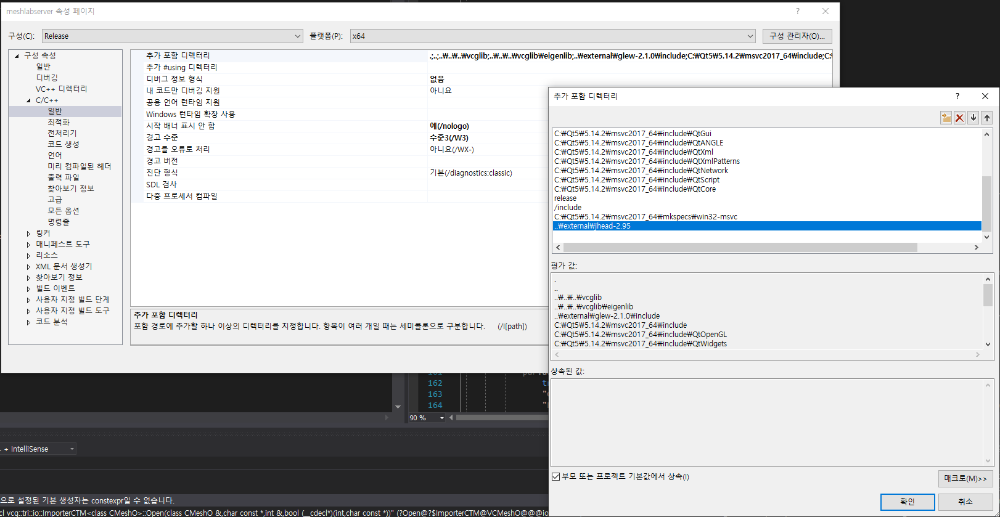

How to Build Meshlab on Windows 10
=======
## Source
1. [MeshLab](https://github.com/cnr-isti-vclab/meshlab.git])
2. [VCG Library](https://github.com/cnr-isti-vclab/vcglib.git])
---
## Environment
```
QT: 5.14.2
MSVC: 2017_64
Windows SDK: 10.0.17763.0

vcglib(commit hash): 910da4c3e310f2e6557bd7a39c4f1529e61573e5
```
---
## Build

### Command
```
# VS 2017용 x64 네이티브 도구 명령 프롬프트 실행
> %comspec% /k "C:\Program Files (x86)\Microsoft Visual Studio\2017\Community\VC\Auxiliary\Build\vcvars64.bat"\

# QT MSVC2017 x64
> set PATH=%PATH%;C:\Qt5\5.14.2\msvc2017_64\bin
```
### external
```
# Generate external.sln
> cd meshlab\src\external
> qmake -tp vc -recursive external.pro

# Build external.sln
```

### meshlab_full
```
# Generate meshlab.sln
> cd meshlab\src
> qmake -tp vc -recursive meshlab.pro

# Build meshlab.sln
```

### Solutions
- jead.h error on **meshlabserver**   


---
## Reference
1. [NAVER Blog](https://m.blog.naver.com/PostView.nhn?blogId=ekthatkxkd&logNo=221007127296&proxyReferer=https:%2F%2Fwww.google.com%2F)
2. [OpenMicro labs](https://openmicrolab.com/meshlab-%EB%B9%8C%EB%93%9C/)
3. [GitHub](https://github.com/cnr-isti-vclab/meshlab/issues/142)
